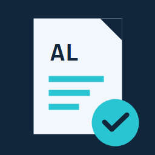

# AL Report Companion

## Enable Report Cop per project

Starting with 0.9.0, diagnostics are disabled by default. Add this entry to the AL project's `.vscode/settings.json` to enable missing-field errors, VB errors, and unused-column warnings:

```json
{
  "bcReportLayouts.enableReportCop": true
}
```

Removing the entry or setting it to `false` clears Companion diagnostics immediately. Linked layouts follow their owning AL project configuration; a shared layout is checked if any owning project enables Report Cop. Standalone layouts use their own resource configuration. `bcReportLayouts.validateVisualBasic` can still disable only VB checks within an enabled project. Manual Validate commands also require Report Cop activation. Opening layouts and F2 column renaming remain available without activation; explicit rename commands may parse layouts to calculate edits. The setting does not turn the extension into an AL compiler analyzer or block compilation. AL documents are not saved by validation.



A companion for Business Central AL reports and their layouts. Open layouts, keep column references aligned, and catch RDLC issues in VS Code before running a report.

## Features at a glance

| Task | How it works |
| --- | --- |
| Open a layout externally | Right-click `RDLCLayout`, `WordLayout` or `LayoutFile` and select **Open Layout (.rdlc)** or **Open Layout (.docx)**. Windows opens the associated application. |
| Read or edit RDLC XML | Select **Open Layout Source (.rdlc)**. An existing text tab is reused, including unsaved changes. Word layouts only open externally. |
| Rename a report column | Press **F2** on its name in the AL dataset. The inline rename updates linked RDLC field definitions and references. Only changed RDLC files are saved automatically; the AL document stays unsaved. |
| Find dataset mismatches | Missing RDLC field references appear as errors in **Problems**. AL columns unused by all linked RDLC layouts appear as warnings. Unicode field names are supported. |
| Check Visual Basic | Embedded `<Code>` and expression values throughout the RDLC are checked for compiler and consistency issues, with English errors in **Problems**. Code is never executed. |
| Edit exported C/AL reports | Open an embedded RDLC in Report Builder, then use **Import Layout (.rdlc)** to transfer saved changes back to the text object. Import guards detect conflicting changes. |

## Example: AL to layout

```al
report 50100 "Sales Report"
{
    RDLCLayout = './Layouts/Sales.rdlc';
    // Right-click: Open Layout (.rdlc) or Open Layout Source (.rdlc)

    dataset
    {
        dataitem(Customer; Customer)
        {
            column(TelefonCaptionLbl; TelefonCaptionLbl) { }
            // F2 on the column name -> TelefonCaptionLblTest
        }
    }
}
```

The linked RDLC expression changes from `Fields!TelefonCaptionLbl.Value` to `Fields!TelefonCaptionLblTest.Value`. Layout paths resolve relative to the AL project containing `app.json`. Multiple layouts declared in `rendering` and report extensions are supported.

## Getting started

1. Install `al-report-companion-0.9.0.vsix` and reload VS Code when prompted.
2. Open and trust a local AL project on Windows.
3. Right-click a layout declaration or use **AL Report Companion** commands in the command palette.

Configure `bcReportLayouts.reportBuilderPath` for a specific Report Builder. `bcReportLayouts.validateVisualBasic` controls VB checks. Existing setting and command IDs are retained for compatibility.

The extension does not provide a visual report designer. VB checks use the Windows .NET Framework compiler with report stubs; report-specific runtime behavior cannot be fully verified. C/AL importability depends on the target NAV version and layout features. The rename does not change VS Code's own Auto Save setting.

The extension ID is now `report-designer-tools.al-report-companion`. Existing temporary C/AL sessions from the previous extension are not automatically adopted; finish their import before switching or retain their temporary files for recovery.

[Detailed workflows and limitations](docs/guide.md)

## Changes in 0.7.1

- Multiline RDLC expressions are normalized only in the generated VB check; original layout files are unchanged. Comments, escaped quotes and explicit continuations retain their source mapping.
- VB diagnostics now appear as errors. BC42105 explains a missing explicit return path instead of reporting a syntax problem. Compiler-unavailable diagnostics are errors as well.
- Problems entries do not themselves block the Microsoft AL compiler. Build enforcement requires a separate validation step in the build or CI workflow.

## Built-in RDLC objects (0.8.0)

Member and argument checks now cover `User`, `Globals` (including `RenderFormat` and its read-only `DeviceInfo`), `Fields`, `Parameters`, `ReportItems`, `Variables`, `DataSets`, `DataSources`, and `Scopes`. For example, `Fields!Amount.Vaule`, `User!Languagge`, and `Variables!Tax.SetValue()` produce errors. Valid `Me.Value`, indexed access and Unicode names are supported. Static parameter, textbox, variable, dataset and data-source names are checked against available layout declarations.

Variant values, dynamically calculated keys, custom indexed field properties, and declared custom assembly instances remain late-bound. The checker does not enforce renderer availability or report/group execution scope.

The member contracts follow [Microsoft built-in object documentation](https://learn.microsoft.com/en-us/sql/reporting-services/report-design/built-in-collections-built-in-globals-and-users-references-report-builder?view=sql-server-ver17) and the [RDL field-property specification](https://learn.microsoft.com/en-us/openspecs/sql_server_protocols/ms-rdl/e0930438-cecf-433c-a356-9ee7231db4ed).

## Source highlighting (0.8.1)

Errors receive red wavy underlines; warnings receive yellow wavy underlines in their source editors. Each diagnostic uses only its corresponding underline color. Hover over a marked range to read the English diagnostic message. VB issues retain Error severity in Problems. VS Code renders the native diagnostic underline and hover once, without additional decorations.

### Faster validation (0.8.4)

Unchanged AL layout references and RDLC validation results are reused. Pending refresh requests are combined, and missing dataset fields appear before the external VB compiler completes. Changed files and validation settings are checked again; unavailable compiler results are retried. AL documents are never saved by validation.

### Diagnostic underlines (0.8.6)

AL and RDLC use native VS Code diagnostic underlines and hover messages only. No additional warning decorations are added.
